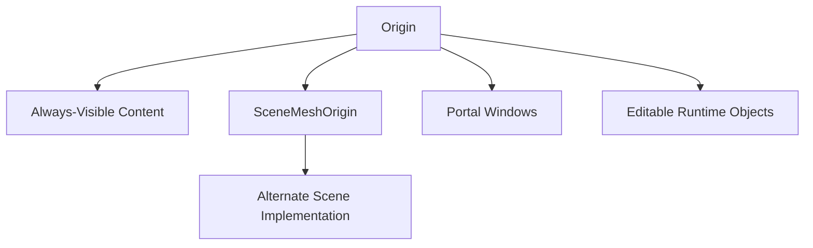

# Architecture Overview

## Purpose

This application is part of the MOZART project and runs on Meta Quest 3.

Its role is to visualize and evaluate robotic food packaging and handling scenarios in a real environment using a diminished reality concept:

- the real room remains visible through passthrough
- selected virtual content is rendered on top
- selected real-world surfaces are visually removed or replaced
- a Portal Window can reveal an Alternate Scene representation of the room

For terminology, read [Glossary](glossary.md) first.

## Main Runtime Systems

### 1. Scene and Action Object Management

`GameManager` is the central runtime coordinator.

Responsibilities:

- listens to navigation changes from the ARCOR2 session
- opens and cleans up scene content
- spawns action objects such as `MAT`, `MatGrid`, `Table`, and Portal Windows
- loads and manages the Alternate Scene implementation
- applies portal-specific materials to the scene mesh implementation

Main file:

- `Assets/Scripts/Managers/GameManager.cs`

### 2. Origin Alignment

The application keeps virtual content organized under a shared `Origin`.

Important transforms:

- `Origin`: root for spawned runtime objects
- `SceneMeshOrigin`: root for the imported or server-provided scene mesh implementation

Additional alignment behavior is coordinated by:

- `MozartSpatialBridge`
- `SpatialAnchorOriginManager`

These systems handle alignment to scanned room data and spatial anchors.

### 3. Alternate Scene Implementation

Conceptually, the user sees an Alternate Scene through Portal Windows.

At code level this is currently implemented mainly by the scene mesh path.

Current behavior:

- the scene mesh is parented under `SceneMeshOrigin`
- its colliders are disabled for rendering use
- the original materials are cached
- a second material set is generated for portal rendering

Relevant code:

- `GameManager.AttachServerSceneMesh`
- `GameManager.ApplySceneMeshRenderMode`

### 4. Diminished Reality and Portal Rendering

The diminished reality effect is achieved through three cooperating elements:

- passthrough wall geometry
- invisible Portal Window mask geometry
- Alternate Scene / portal content geometry

The current implementation intentionally avoids URP `RenderObjects` features on mobile XR because they caused periodic frame spikes and visual instability on device.

### 5. Always-Visible Runtime Content

Interactive runtime objects such as `MAT` and `MatGrid` are rendered using standard renderer components with a lightweight overlay material path managed by:

- `Assets/Scripts/Managers/AlwaysVisibleContentRenderer.cs`

This keeps them visible regardless of scene depth while avoiding the Quest instability that appeared with custom renderer passes.

## High-Level Scene Graph

## Layer Model

Current relevant layers:

| Layer | Name | Role |
|---|---|---|
| 6 | `background` | background-related content |
| 7 | `passthroughWalls` | geometry using passthrough wall materials |
| 8 | `content` | legacy layer, currently deprecated |
| 9 | `portalMask` | invisible Portal Window masks writing depth and stencil |
| 10 | `portalContent` | Alternate Scene content visible through portals |

Important note:

- `content` still exists in Unity's layer table to preserve layer indices
- it should be considered legacy and should not be used for new runtime rendering paths

## Current Rendering Strategy on Mobile

`Assets/Settings/Mobile_Renderer.asset` is currently simplified:

- no active `RenderObjects` features
- no active custom portal renderer feature chain
- portal behavior is handled by shader/material logic
- standard URP opaque/transparent passes are used instead

This design was chosen after profiling showed that the older `RenderObjects`-based stencil path caused regular render-loop spikes and XR drift artifacts on Quest.
